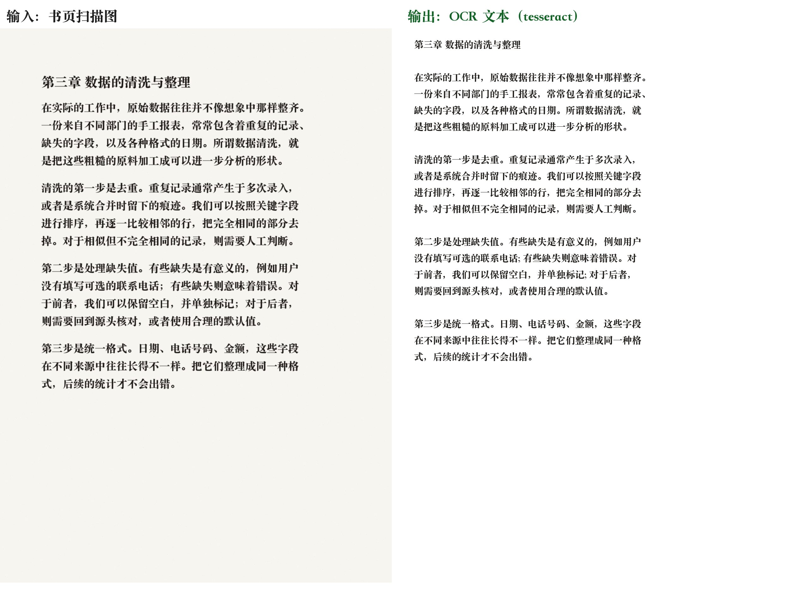

# Chinese PDF OCR Toolkit 中文扫描版 PDF OCR 工具箱

[](LICENSE)
[](https://www.python.org)

Battle-tested OCR pipeline for **Chinese scanned books** — from modern typeset pages to dense vertical-layout classical woodblock prints. Every pitfall in these scripts was paid for in real production runs over thousands of pages.

针对**中文扫描版书籍**的实战 OCR 管线——从现代排版书到密集竖排木刻古籍。每一条踩坑记录都来自数千页的真实生产运行。

## Why this exists / 为什么有这个仓库

Most OCR tutorials stop at "run tesseract on your image". Real Chinese book scanning hits walls they never mention:

- **MuPDF hangs forever** on corrupted PDFs (C-level syscall, `SIGALRM` can't interrupt it, `multiprocessing.terminate()` doesn't help)
- **VLM OCR hallucinates** — repeats single characters, loops n-grams, outputs garbage with perfect confidence
- **Dense vertical classical text** defeats modern VL models entirely (they grab ~400 chars and stop)
- **NAS storage I/O** silently destroys parallelism

大多数 OCR 教程止步于"对图片跑 tesseract"。真实的中文书籍扫描会遇到他们从不提及的墙：

- **损坏 PDF 让 MuPDF 永久卡死**（卡在 C 层 syscall，signal 打不进去，terminate 也救不了）
- **视觉模型 OCR 会幻觉**——单字复读、n-gram 循环、输出乱码但自信满满
- **密集竖排文言**直接击穿现代 VL 模型（抓 400 字就停）
- **NAS 存储 I/O** 静默摧毁并行效率

## Tools / 工具清单

### `tools/ocr_vlm_batch.py` — VLM batch OCR 视觉模型批量 OCR
Vision-model OCR via SiliconFlow API (GLM-4.5V), with **4-layer hallucination detection**, resume-from-breakpoint, and per-page retry:

1. Single-character repetition > 60%
2. Unique-character ratio < 5%
3. Shannon entropy < 2.5 (for text > 50 chars)
4. 3-gram loop detection (≤10 distinct n-grams with >50% dominance)

视觉模型 OCR（SiliconFlow API / GLM-4.5V），带**四层幻觉检测**、断点续传、逐页重试。

```bash
export SILICONFLOW_API_KEY=sk-xxx
export OCR_PAGES_DIR=~/my_book_pages   # one subdir per volume 单卷一目录，单页jpg
python3 tools/ocr_vlm_batch.py --vol VOL-01
python3 tools/ocr_vlm_batch.py --vol VOL-01 --limit 5   # test run 试跑
```

### `tools/split_double_pages.py` — Double-page splitter 双页拆分
Classical woodblock scans are often two pages side-by-side. This splits them into single pages with proper numbering (handles image centering detection).

木刻版扫描件常是左右双页合排。本工具自动拆分为单页并正确编号（含页面居中检测）。

### `tools/clean_md.py` — Markdown post-cleanup OCR 产出清洗
Fixes common OCR artifacts in Markdown output: broken punctuation, spurious line breaks, full/half-width chaos.

修复 OCR 产出 Markdown 的常见问题：标点断裂、错误换行、全半角混乱。

### `tools/fix_hallucinations.py` — Quality-gated re-OCR 质量门重跑
Re-OCR specific pages that failed quality checks; only saves output that passes the 4-layer gate.

对质量检测不合格的页面重跑 OCR，只有通过四层质检的产出才会保存。

## Hard-won lessons / 血泪教训

| Lesson 教训 | Detail 详情 |
|---|---|
| Kill with `-9` | MuPDF hangs are C-level. Bash scheduling + independent subprocess + `kill -9` is the **only** reliable pattern. SIGALRM and multiprocessing both fail. 卡死在 C 层，唯一可靠方案是 bash 调度+独立子进程+kill -9 |
| 72 dpi is fine | For PDFs > 20MB, 72dpi renders 4-5x faster; tesseract upscales internally, quality loss is negligible. 大 PDF 用 72dpi，快 4-5 倍，质量损失可忽略 |
| Redirect stderr *inside* Python | MuPDF floods stderr with ExtGState errors. Use `os.dup2` — but never `2>/dev/null` at the shell level (it eats stdout too). 必须在 Python 内 os.dup2 重定向，shell 层重定向会连 stdout 一起吞 |
| `/private/tmp/` not `/tmp/` | On ARM macOS, homebrew tesseract requires the real path (symlink differences). ARM Mac 上 homebrew tesseract 必须用真实路径 |
| Copy to local SSD first | On exFAT NAS volumes, 16-way parallelism is *slower* than single-threaded. 4-way on local APFS = 4x speedup. NAS 上先拷到本地 SSD 再跑 |
| AI vision can't judge OCR quality | Asking a VLM "is this OCR correct?" was off by 30% vs ground truth. Always diff against the original by hand. 用 AI 视觉评估 OCR 准确率偏差可达 30%，必须逐字对比原图 |

## Demo / 效果示例



*Synthetic sample page（合成样张：印刷宋体+扫描噪点，非实扫描件——如实标注，演示印刷体中文的识别效果）*

## Pipeline / 管线架构

See [docs/pipeline.md](docs/pipeline.md) for the full architecture diagram.

## Which model for which page / 什么页用什么模型

| Page type 页面类型 | Recommended 推荐 |
|---|---|
| Modern typeset book 现代排版书 | VLM (GLM-4.5V etc.) or MinerU |
| Woodblock, sparse text 木刻·稀疏 | VLM ✅ |
| **Dense vertical classical 密集竖排古籍** | tesseract / MinerU OCR（VL 模型只抓 400 字 ❌）|

## License

MIT — use it, fork it, ship it.

## Acknowledgments

Built from production runs digitizing Chinese classical texts (数千页木刻版古籍数字化实战).

⚠️ Please respect copyright of the books you scan. The authors of this repo take no responsibility for misuse. 请遵守您所扫描书籍的版权法规。
